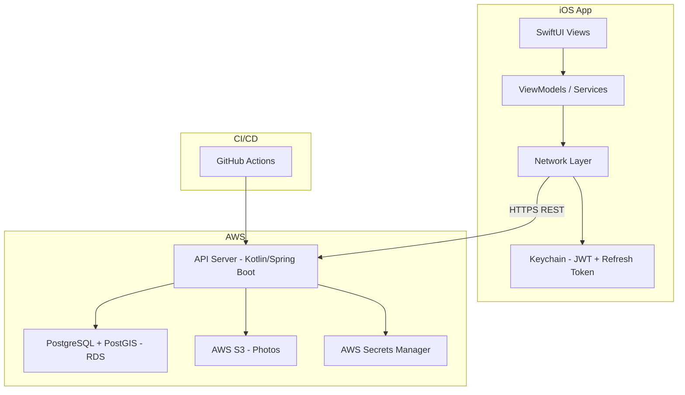
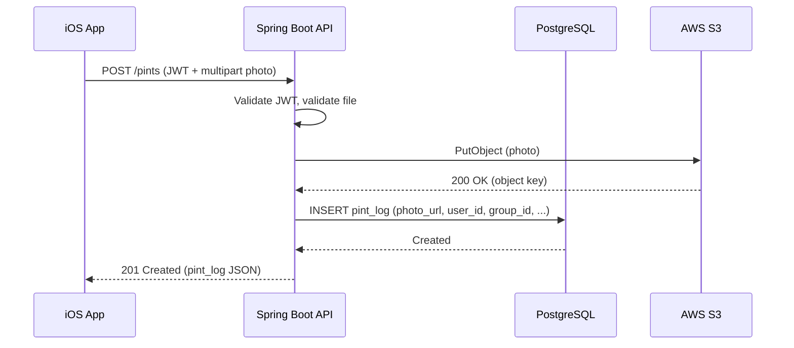
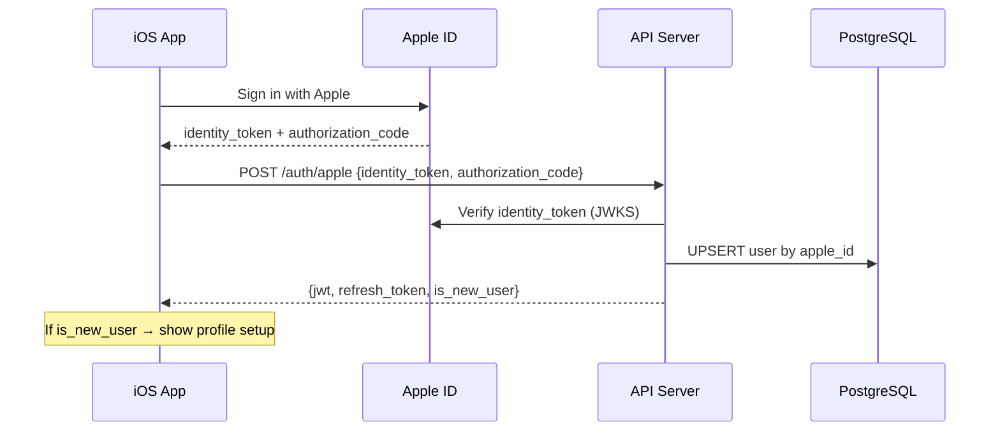
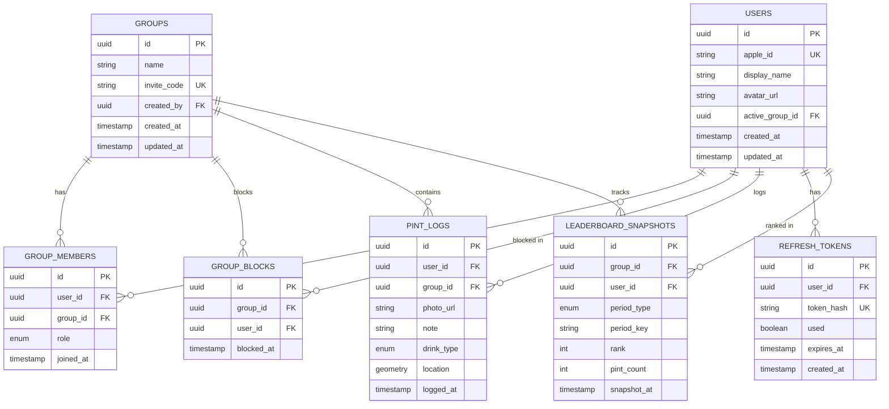

# Design Document — Pint King

## Overview

Pint King is a social beer-tracking iOS app backed by a Kotlin/Spring Boot REST API. The system enables users to authenticate via Sign in with Apple, create/join groups, log pints with photo proof and optional metadata, compete on time-filtered leaderboards, and visualise consumption locations on a map.

The architecture follows a standard client-server model:
- **iOS Client** — SwiftUI + MapKit, communicates exclusively via REST.
- **API Server** — Kotlin + Spring Boot, stateless, JWT-authenticated.
- **Data Layer** — PostgreSQL + PostGIS on AWS RDS, AWS S3 for photo storage.

Key design decisions:
1. **S3-first for creation** — Photos are uploaded to S3 before the DB record is inserted. If the DB insert fails, the orphaned S3 object is queued for async cleanup.
2. **DB-first for deletion** — The DB record is deleted first; S3 cleanup happens asynchronously. This avoids blocking the user on S3 latency and handles partial failures gracefully.
3. **Active Group persistence** — The user's currently selected group is stored on the `users` table to survive app restarts and device changes.
4. **Invite blocklist** — A separate `group_blocks` table stores removed user IDs per group. The invite code join flow checks this table to prevent re-entry.
5. **Leaderboard rank delta** — Computed by comparing the current period's rank to a snapshot of the previous period's final ranking.

---

## Architecture



### High-Level Request Flow



### Deployment Architecture

| Component | AWS Service | Notes |
|-----------|-------------|-------|
| API Server | ECS Fargate or App Runner | Stateless, horizontally scalable |
| Database | RDS PostgreSQL (PostGIS) | Single-AZ for MVP, Multi-AZ later |
| Photo Storage | S3 | Private bucket, pre-signed URLs for reads |
| Secrets | Secrets Manager | DB creds, JWT signing key, Apple auth keys |
| CI/CD | GitHub Actions | Build → Test → Deploy pipeline |

### Authentication Flow



---

## Components and Interfaces

### iOS App Components

| Component | Responsibility |
|-----------|---------------|
| `AuthService` | Manages Sign in with Apple flow, token storage (Keychain), silent refresh |
| `NetworkClient` | HTTP client with automatic JWT injection and 401 retry logic |
| `PintCameraView` | Full-screen camera capture (AVFoundation), image validation |
| `LeaderboardViewModel` | Fetches and displays ranked members with time-period filtering |
| `MapViewModel` | Manages MapKit annotations, bounding-box queries, pin rendering |
| `GroupService` | Group CRUD, invite code handling, active group switching |
| `ProfileViewModel` | Display name editing, avatar upload |

### API Endpoints

#### Auth

| Method | Path | Description |
|--------|------|-------------|
| POST | `/auth/apple` | Exchange Apple identity token for JWT + refresh token |
| POST | `/auth/refresh` | Rotate refresh token, issue new JWT |
| POST | `/auth/logout` | Invalidate all refresh tokens for user |

#### Users

| Method | Path | Description |
|--------|------|-------------|
| GET | `/users/me` | Get authenticated user profile |
| PATCH | `/users/me` | Update display_name, active_group_id |
| POST | `/users/me/avatar` | Upload avatar image (multipart) |
| DELETE | `/users/me` | Delete account (full cascade) |

#### Groups

| Method | Path | Description |
|--------|------|-------------|
| POST | `/groups` | Create a new group |
| GET | `/groups` | List groups the user belongs to |
| GET | `/groups/{id}` | Get group details |
| PATCH | `/groups/{id}` | Update group name (admin only) |
| DELETE | `/groups/{id}/members/{userId}` | Remove member (admin) or leave (self) |
| POST | `/groups/{id}/members/{userId}/promote` | Promote member to admin |
| POST | `/groups/{id}/invite-code/regenerate` | Regenerate invite code (admin) |
| POST | `/groups/join` | Join group by invite code |

#### Pints

| Method | Path | Description |
|--------|------|-------------|
| POST | `/pints` | Create pint log (multipart: photo + metadata) |
| GET | `/pints?group_id=&period=&page=&size=` | List pints for a group (paginated) |
| PATCH | `/pints/{id}` | Update note or drink_type |
| DELETE | `/pints/{id}` | Delete pint (within 24h window) |

#### Leaderboard

| Method | Path | Description |
|--------|------|-------------|
| GET | `/groups/{id}/leaderboard?period=all_time\|this_week\|this_month` | Get ranked leaderboard with deltas |

#### Map

| Method | Path | Description |
|--------|------|-------------|
| GET | `/pints/map?group_id=&scope=personal\|group&sw_lat=&sw_lng=&ne_lat=&ne_lng=` | Bounding-box pint query |

### API Response Conventions

- **Success**: 200 (GET/PATCH), 201 (POST create), 204 (DELETE)
- **Client errors**: 400 (validation), 401 (auth), 403 (forbidden), 404 (not found), 409 (conflict), 422 (unprocessable)
- **Server errors**: 500 (internal)
- **Pagination**: Offset-based with `page`, `size`, `total` in response envelope
- **Timestamps**: ISO 8601 UTC (`2024-01-15T14:30:00Z`)

---

## Data Models

### Entity Relationship Diagram



### Table Definitions

#### `users`

| Column | Type | Constraints | Notes |
|--------|------|-------------|-------|
| id | UUID | PK, default gen_random_uuid() | |
| apple_id | VARCHAR(255) | UNIQUE, NOT NULL | From Sign in with Apple |
| display_name | VARCHAR(30) | NOT NULL | 1–30 chars |
| avatar_url | TEXT | NULLABLE | S3 URL |
| active_group_id | UUID | FK → groups.id, NULLABLE | Persisted active group |
| created_at | TIMESTAMPTZ | NOT NULL, default now() | |
| updated_at | TIMESTAMPTZ | NOT NULL, default now() | |

#### `groups`

| Column | Type | Constraints | Notes |
|--------|------|-------------|-------|
| id | UUID | PK, default gen_random_uuid() | |
| name | VARCHAR(50) | NOT NULL | 1–50 chars |
| invite_code | VARCHAR(8) | UNIQUE, NOT NULL | 8 alphanumeric |
| created_by | UUID | FK → users.id, NOT NULL | Creator |
| created_at | TIMESTAMPTZ | NOT NULL, default now() | |
| updated_at | TIMESTAMPTZ | NOT NULL, default now() | |

#### `group_blocks`

| Column | Type | Constraints | Notes |
|--------|------|-------------|-------|
| id | UUID | PK, default gen_random_uuid() | |
| group_id | UUID | FK → groups.id, NOT NULL | |
| user_id | UUID | FK → users.id, NOT NULL | Blocked user |
| blocked_at | TIMESTAMPTZ | NOT NULL, default now() | When the user was removed |

**Unique constraint**: `(group_id, user_id)`
**Index**: `idx_group_blocks_lookup` on `(group_id, user_id)` — for join check on invite code use

#### `group_members`

| Column | Type | Constraints | Notes |
|--------|------|-------------|-------|
| id | UUID | PK, default gen_random_uuid() | |
| user_id | UUID | FK → users.id, NOT NULL | |
| group_id | UUID | FK → groups.id, NOT NULL | |
| role | VARCHAR(10) | NOT NULL, CHECK (role IN ('admin', 'member')) | |
| joined_at | TIMESTAMPTZ | NOT NULL, default now() | |

**Unique constraint**: `(user_id, group_id)`

#### `pint_logs`

| Column | Type | Constraints | Notes |
|--------|------|-------------|-------|
| id | UUID | PK, default gen_random_uuid() | |
| user_id | UUID | FK → users.id, NOT NULL | |
| group_id | UUID | FK → groups.id, NOT NULL | |
| photo_url | TEXT | NOT NULL | S3 object URL |
| note | VARCHAR(280) | NULLABLE | Optional text note |
| drink_type | VARCHAR(20) | NULLABLE, CHECK (drink_type IN ('beer','lager','ale','stout','cider')) | |
| location | GEOMETRY(Point, 4326) | NULLABLE | PostGIS point |
| logged_at | TIMESTAMPTZ | NOT NULL, default now() | When the pint was logged |

**Indexes**:
- `idx_pint_logs_group_logged` on `(group_id, logged_at DESC)` — leaderboard queries
- `idx_pint_logs_user_logged` on `(user_id, logged_at DESC)` — personal history
- `idx_pint_logs_location` GIST index on `location` — bounding-box map queries

#### `refresh_tokens`

| Column | Type | Constraints | Notes |
|--------|------|-------------|-------|
| id | UUID | PK, default gen_random_uuid() | |
| user_id | UUID | FK → users.id, NOT NULL | |
| token_hash | VARCHAR(64) | UNIQUE, NOT NULL | SHA-256 of token |
| used | BOOLEAN | NOT NULL, default false | Single-use flag |
| expires_at | TIMESTAMPTZ | NOT NULL | 30 days from creation |
| created_at | TIMESTAMPTZ | NOT NULL, default now() | |

**Index**: `idx_refresh_tokens_user` on `(user_id)` — for bulk invalidation

#### `leaderboard_snapshots`

| Column | Type | Constraints | Notes |
|--------|------|-------------|-------|
| id | UUID | PK, default gen_random_uuid() | |
| group_id | UUID | FK → groups.id, NOT NULL | |
| user_id | UUID | FK → users.id, NOT NULL | |
| period_type | VARCHAR(10) | NOT NULL, CHECK (period_type IN ('week', 'month')) | |
| period_key | VARCHAR(10) | NOT NULL | e.g. "2024-W03" or "2024-01" |
| rank | INTEGER | NOT NULL | |
| pint_count | INTEGER | NOT NULL | |
| snapshot_at | TIMESTAMPTZ | NOT NULL, default now() | |

**Unique constraint**: `(group_id, user_id, period_type, period_key)`
**Index**: `idx_snapshots_lookup` on `(group_id, period_type, period_key)`

### S3 Object Key Structure

```
pint-king-photos/
├── avatars/{user_id}/{uuid}.jpg
└── pints/{user_id}/{group_id}/{uuid}.jpg
```

- All photos stored as JPEG (converted from HEIC/PNG on upload if needed).
- Read access via pre-signed URLs (15-minute expiry) generated by the API.
- Write access via direct multipart upload to the API (API writes to S3).

---


## Correctness Properties

*A property is a characteristic or behavior that should hold true across all valid executions of a system — essentially, a formal statement about what the system should do. Properties serve as the bridge between human-readable specifications and machine-verifiable correctness guarantees.*

### Property 1: Idempotent user creation

*For any* valid `apple_id`, authenticating multiple times SHALL always return the same user record (same `id`) and SHALL never create duplicate user records. The user count for that `apple_id` SHALL always be exactly 1.

**Validates: Requirements 1.2, 1.4**

### Property 2: Token expiry correctness

*For any* successfully authenticated user, the issued JWT SHALL have an expiry exactly 1 hour from issuance, and the issued Refresh_Token SHALL have an expiry exactly 30 days from issuance.

**Validates: Requirements 1.5**

### Property 3: Token rotation single-use

*For any* valid refresh token that is used to obtain a new token pair, the original refresh token SHALL be marked as used and SHALL no longer be accepted for subsequent refresh requests.

**Validates: Requirements 1.8**

### Property 4: Expired and invalid token rejection

*For any* refresh token that has expired (past 30-day window) or does not exist in the system, the API SHALL return a 401 response and SHALL NOT issue new tokens.

**Validates: Requirements 1.9**

### Property 5: Token reuse detection and family invalidation

*For any* refresh token that has already been used (marked `used = true`), submitting it to the refresh endpoint SHALL invalidate ALL refresh tokens belonging to that user and return a 401 response.

**Validates: Requirements 1.10**

### Property 6: File upload validation

*For any* uploaded file, the API SHALL accept it if and only if (a) the content type is JPEG or PNG, AND (b) the file size does not exceed the applicable limit (5 MB for avatars, 10 MB for pint photos). All other files SHALL be rejected with a 422 response.

**Validates: Requirements 2.3, 2.5, 4.7, 4.9, 7.6, 7.7**

### Property 7: Initials generation from display name

*For any* non-empty display name, the generated initials placeholder SHALL contain the first character of the first word and the first character of the last word (or just the first character if single-word), and SHALL never be empty.

**Validates: Requirements 2.7**

### Property 8: Group name length validation

*For any* string submitted as a group name, the API SHALL accept it if and only if its trimmed length is between 1 and 50 characters inclusive. Strings outside this range SHALL be rejected with a 400 response.

**Validates: Requirements 3.1**

### Property 9: Group creation limit enforcement

*For any* user who has already created 99 groups, attempting to create an additional group SHALL be rejected with a 422 response. For any user with fewer than 99 created groups, creation SHALL succeed.

**Validates: Requirements 3.2**

### Property 10: Invite code format invariant

*For any* newly created or regenerated invite code, it SHALL be exactly 8 characters long, composed only of alphanumeric characters (a-z, A-Z, 0-9), and SHALL be unique across all groups in the system.

**Validates: Requirements 3.3**

### Property 11: Group join outcome correctness

*For any* user attempting to join a group via invite code: (a) if the code does not match any group, the result SHALL be 404; (b) if the user is already a member, the result SHALL be 409; (c) if a `group_blocks` record exists for that user and group, the result SHALL be 403; (d) otherwise, the user SHALL be added as a member with role 'member'.

**Validates: Requirements 3.5, 3.7, 3.8, 3.9**

### Property 12: Invite code regeneration invalidation

*For any* group whose invite code is regenerated, the previous invite code SHALL no longer resolve to that group (returning 404), and the new code SHALL be valid for joining.

**Validates: Requirements 3.10**

### Property 13: Member removal consequences

*For any* group member removed by an admin: (a) the `group_members` record SHALL be deleted; (b) all pint_logs created by that user for that group SHALL be retained in the database; (c) a record SHALL be inserted into `group_blocks` for that user and group; (d) any subsequent API request from that user targeting that group SHALL return 403.

**Validates: Requirements 3.11, 3.14, 3.15**

### Property 14: Role promotion correctness

*For any* group member promoted by an admin, their role SHALL change from 'member' to 'admin', and they SHALL subsequently be able to perform admin actions on that group.

**Validates: Requirements 3.12**

### Property 15: Leave validation

*For any* user attempting to leave a group: if they are the sole admin and other members exist, the leave SHALL be rejected; if they are not the sole admin, or if no other members exist, the leave SHALL succeed and their `group_members` record SHALL be deleted.

**Validates: Requirements 3.17**

### Property 16: Active group invariant

*For any* user who belongs to at least one group, they SHALL have exactly one `active_group_id` set, and that ID SHALL reference a group they are currently a member of. When their active group is removed, it SHALL automatically fall back to another group they belong to (or NULL if none remain).

**Validates: Requirements 3.19, 3.21, 3.22, 3.23**

### Property 17: Pint creation integrity

*For any* pint log creation request: (a) a photo must be present or the request SHALL be rejected; (b) the pint_log SHALL be associated with the authenticated user's ID and their current active_group_id; (c) the database record SHALL only be inserted after successful S3 upload — if S3 fails, no database record SHALL exist.

**Validates: Requirements 4.4, 4.6, 4.10**

### Property 18: Pint metadata validation

*For any* pint log note, it SHALL be accepted if and only if its length is at most 280 characters. *For any* drink_type value, it SHALL be accepted if and only if it is one of: 'beer', 'lager', 'ale', 'stout', 'cider'.

**Validates: Requirements 4.11, 4.12**

### Property 19: Pint deletion time window

*For any* pint log, deletion by its creator SHALL succeed if and only if the current time is within 24 hours of the pint's `logged_at` timestamp. Deletion attempts after 24 hours SHALL be rejected.

**Validates: Requirements 4.16**

### Property 20: Leaderboard ranking with dense ties

*For any* group and time period, the leaderboard SHALL rank members in descending order of pint count. Members with equal counts SHALL share the same rank. The next distinct rank SHALL be the shared rank + 1 (dense ranking, not standard competition ranking).

**Validates: Requirements 5.1, 5.6**

### Property 21: Time-period filtering correctness

*For any* group and set of pint logs, filtering by "This Week" SHALL count only logs with `logged_at` within the current ISO week (Mon 00:00 – Sun 23:59 UTC), and filtering by "This Month" SHALL count only logs within the current calendar month. "All-Time" SHALL count all logs.

**Validates: Requirements 5.3, 5.4**

### Property 22: Rank delta computation

*For any* group member's current rank in a filtered period (week or month), the rank delta SHALL equal (previous period's final snapshot rank − current rank). A positive delta means improvement. If no previous snapshot exists for that member, the delta SHALL be null.

**Validates: Requirements 5.7, 5.8**

### Property 23: Former members excluded from active ranking

*For any* group with former members (users whose `group_members` record was deleted but whose pint_logs remain), those former members SHALL NOT be assigned a rank, SHALL NOT affect the rank calculation of active members, and SHALL appear in a separate section.

**Validates: Requirements 5.12**

### Property 24: Bounding-box spatial query correctness

*For any* bounding box defined by (sw_lat, sw_lng, ne_lat, ne_lng) and any set of pint logs: (a) all returned logs SHALL have a location within the bounding box; (b) no log with a location within the bounding box SHALL be excluded; (c) logs without a location SHALL never be returned.

**Validates: Requirements 6.8, 6.9**

### Property 25: JWT authentication enforcement

*For any* API request (excluding auth endpoints), if the request does not include a valid, non-expired JWT, the API SHALL return a 401 response regardless of the endpoint or HTTP method.

**Validates: Requirements 7.1**

### Property 26: Authorization enforcement

*For any* authenticated user: (a) attempting to read or write pint_logs for a group they are not a member of SHALL return 403; (b) attempting admin actions (remove member, promote, update group name) without the 'admin' role SHALL return 403.

**Validates: Requirements 7.2, 7.3**

### Property 27: Request schema validation

*For any* API request with a malformed or incomplete request body (missing required fields, wrong types, out-of-range values), the API SHALL return a 400 response containing field-level error details.

**Validates: Requirements 7.4**

### Property 28: Account deletion cascade

*For any* user who confirms account deletion: (a) the user record SHALL be deleted; (b) all their pint_logs SHALL be deleted; (c) all their S3 photos SHALL be queued for deletion; (d) all their refresh_tokens SHALL be deleted; (e) they SHALL be removed from all groups; (f) if they were the sole admin of a group with other members, the longest-standing member SHALL be promoted; (g) if they were the sole member of a group, the group SHALL be deleted. The entire operation SHALL be atomic (no partial state).

**Validates: Requirements 8.3, 8.4, 8.6**

---

## Error Handling

### Client-Side Error Handling (iOS App)

| Scenario | Behaviour |
|----------|-----------|
| Network unreachable | Display offline banner, queue retry for pint creation |
| 401 from API | Attempt silent token refresh; if refresh fails, clear Keychain and show login |
| 403 from API | Display contextual "access denied" message (e.g. "You have been removed from this group") |
| 404 from API | Display "not found" message |
| 409 from API | Display "already a member" message |
| 422 from API | Display field-level validation errors inline |
| 500 from API | Display generic "Something went wrong, please try again" message |
| S3 upload timeout | Retry once automatically; if still failing, show error and return to camera |
| Location timeout (10s) | Submit pint without location silently |
| Image validation failure | Display inline error before upload attempt |

### Server-Side Error Handling (API)

| Scenario | Response | Side Effects |
|----------|----------|--------------|
| Invalid/expired JWT | 401 | None |
| Reused refresh token | 401 | Invalidate ALL user tokens (security) |
| Unauthorized group access | 403 | None |
| Blocked user join attempt | 403 | None |
| Invalid request body | 400 + field errors | None |
| Invalid file type/size | 422 | None |
| Duplicate group membership | 409 | None |
| S3 upload failure during pint creation | 500 | No DB record created |
| DB insert failure after S3 upload | 500 | Queue orphaned S3 object for async cleanup |
| Account deletion partial failure | Rollback | Transaction ensures atomicity for DB; S3 cleanup is async |

### Async Cleanup Strategy

For operations where S3 and DB cannot be atomic:

1. **Orphaned photo cleanup** — A scheduled job (cron or SQS consumer) scans for S3 objects that have no corresponding `pint_logs.photo_url` or `users.avatar_url` reference and deletes them.
2. **Account deletion S3 cleanup** — After the DB transaction commits (deleting user, pint_logs, etc.), S3 deletions are dispatched asynchronously. A dead-letter queue captures failures for manual review.
3. **Pint deletion S3 cleanup** — DB record is deleted first (within transaction). S3 deletion is dispatched async. If S3 delete fails, the orphan cleanup job catches it.

---

## Testing Strategy

### Unit Tests

Unit tests cover specific examples, edge cases, and error conditions:

- **Auth service**: Token generation with correct expiry, refresh rotation, reuse detection
- **Validation logic**: Group name boundaries (0, 1, 50, 51 chars), note length, file type/size checks
- **Leaderboard computation**: Specific ranking scenarios (ties, single member, empty group)
- **Invite code generation**: Format validation, uniqueness check
- **Active group logic**: Auto-assignment, fallback on removal
- **Deletion window**: Boundary at exactly 24h

### Property-Based Tests

Property-based tests verify universal properties across randomised inputs. The project SHALL use **Kotest** (Kotlin) with its property-based testing module (`kotest-property`) for the API, and **SwiftCheck** for the iOS app where applicable.

**Configuration**:
- Minimum 100 iterations per property test
- Each property test references its design document property
- Tag format: **Feature: pint-king, Property {number}: {property_text}**

**Key properties to implement as PBT**:
- Property 6 (file validation) — generate random file sizes and content types
- Property 10 (invite code format) — verify format invariant across many generations
- Property 11 (join outcome) — generate combinations of code validity, membership, blocklist
- Property 16 (active group invariant) — generate sequences of join/leave/remove operations
- Property 17 (pint creation integrity) — generate creation requests with/without photos, mock S3 failures
- Property 18 (pint metadata validation) — generate random strings and enum values
- Property 19 (deletion time window) — generate timestamps around the 24h boundary
- Property 20 (leaderboard ranking) — generate random pint count distributions
- Property 21 (time-period filtering) — generate logs with timestamps across period boundaries
- Property 22 (rank delta) — generate current/previous rank pairs
- Property 24 (bounding-box query) — generate random points and bounding boxes
- Property 26 (authorization) — generate user/group/role combinations
- Property 28 (account deletion cascade) — generate users with varying group/pint configurations

### Integration Tests

Integration tests verify end-to-end flows with real (or containerised) infrastructure:

- **Auth flow**: Sign in with Apple mock → token issuance → refresh → expiry
- **Pint creation flow**: Photo upload to S3 → DB insert → verify both exist
- **Pint deletion flow**: DB delete → async S3 cleanup → verify both removed
- **Account deletion flow**: Full cascade with S3 cleanup verification
- **Map query**: PostGIS bounding-box with real spatial data
- **Leaderboard snapshot**: Period rollover and delta computation

### CI/CD Pipeline (GitHub Actions)

```
Build → Unit Tests → Property Tests → Integration Tests (Testcontainers) → Deploy
```

- Unit + property tests run on every PR
- Integration tests run with Testcontainers (PostgreSQL + PostGIS, LocalStack for S3)
- Deploy to staging on merge to `main`; production deploy is manual gate
