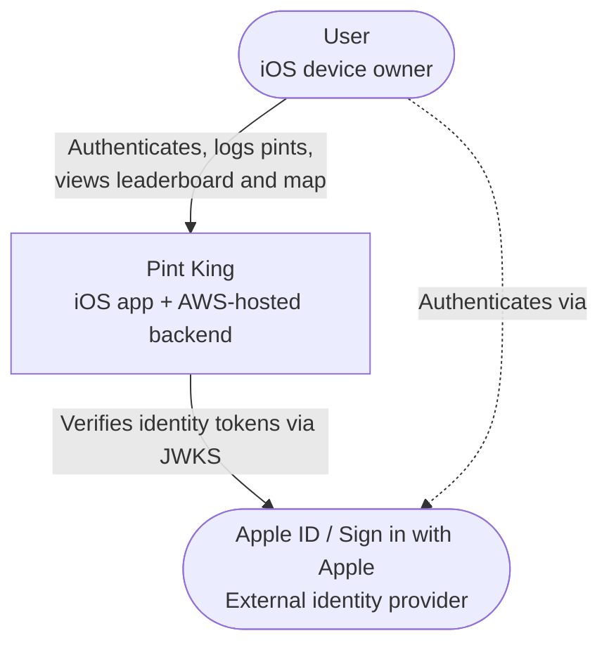

# 01 — System Context (C4 Level 1)

## Purpose

This document describes Pint King at the highest level of abstraction: the system as a single black box, the people who use it, and the external systems it depends on.

It deliberately contains **no internal detail** about how Pint King is structured. For that, see [`02-containers.md`](./l2-containers.md).

---

## What is Pint King

Pint King is a social beer-tracking iOS application. Friends form groups and compete to see who has consumed the most pints over a chosen time period. Each pint is logged with a mandatory photo and optional metadata (note, location, drink type). The app surfaces a ranked leaderboard per group and a map showing where pints were consumed.

The product is iOS-only. The backend is hosted on AWS.

## System Context Diagram

## Actors and External Systems

| Entity | Type | Role |
|--------|------|------|
| **User** | Human actor | An iOS device owner who installs the app, authenticates with their Apple ID, joins or creates groups, and logs pints. Users may be Group Admins or Group Members within any given group. |
| **Apple ID / Sign in with Apple** | External system | Apple's identity service. Pint King relies on it for all authentication; the app does not manage passwords. The backend verifies Apple-issued identity tokens via Apple's public JWKS. |

## Quality Attributes

Non-functional concerns relevant at the system level:

- **Security** — All API traffic is authenticated; user data is access-controlled per group membership; secrets are not stored in code.
- **Privacy** — Account deletion is irreversible and removes all personal data, including photos.
- **Availability** — Single-AZ for MVP; expected to evolve toward multi-AZ post-launch.
- **Latency** — The primary user flow (logging a pint) must feel instant; tolerate up to ~10s for GPS lookup before silently giving up.
