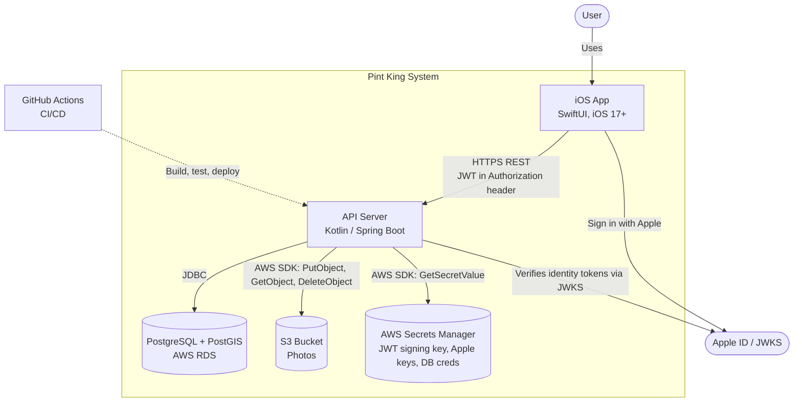
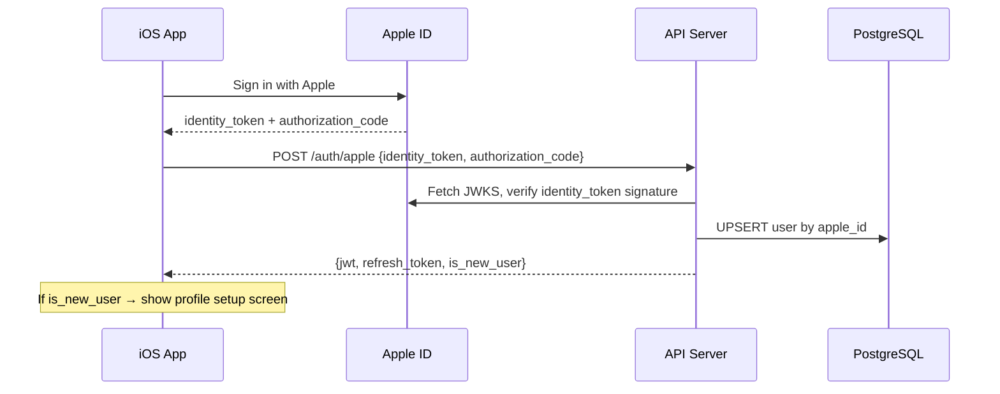
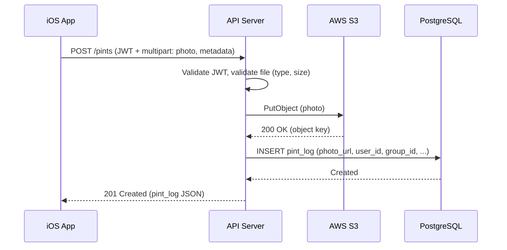

# 02 — Containers (C4 Level 2)

## Purpose

This document decomposes Pint King into its **containers** — independently deployable or runnable units — and describes the protocols by which they communicate. It does not describe what is inside each container; for that, see the L3 documents:

- [`03-ios-app.md`](./l3-ios-app.md) — iOS app internals
- [`04-api.md`](./l3-api.md) — API internals
- [`05-database.md`](./l3-database.md) — database schema

---

## Container Diagram



## Containers

| Container | Technology | Runs On | Responsibility |
|-----------|-----------|---------|----------------|
| **iOS App** | SwiftUI, AVFoundation, MapKit, CoreLocation, URLSession | User device (iOS 17+) | Presents UI, captures photos, calls the API, stores credentials in the iOS Keychain. The only client. |
| **API Server** | Kotlin, Spring Boot | AWS ECS Fargate *or* App Runner (open ADR) | Stateless REST API. Authenticates and authorises requests, validates inputs, orchestrates DB and S3 operations, enforces business rules. |
| **Database** | PostgreSQL 16 with PostGIS extension | AWS RDS (Single-AZ for MVP) | Persists all relational and geospatial state: users, groups, group members, blocklists, pint logs, refresh tokens, leaderboard snapshots. |
| **Object Storage** | AWS S3 | AWS S3 (private bucket, region-local) | Stores pint photos and user avatars as JPEG. Read access via API-issued pre-signed URLs (15-minute expiry). |
| **Secrets Store** | AWS Secrets Manager | AWS Secrets Manager | Stores the JWT signing key, Apple integration keys, and database credentials. Accessed by the API at startup and on rotation. |

## Inter-Container Protocols

| From → To | Protocol | Auth | Notes |
|-----------|----------|------|-------|
| iOS App → API | HTTPS REST (JSON; multipart for uploads) | `Authorization: Bearer <JWT>` per request | The only network channel from the client. Photos uploaded as multipart, not as base64. |
| iOS App → Apple | Sign in with Apple SDK | Apple-controlled flow | Returns `identity_token` and `authorization_code` to the app, which forwards them to the API. |
| API → Apple | HTTPS GET to Apple's JWKS endpoint | None (public keys) | Used to verify the signature on `identity_token`s received from the client. |
| API → DB | JDBC over TLS | DB user/password fetched from Secrets Manager | Connection pool tuned per ADR (open). |
| API → S3 | AWS SDK (HTTPS) | IAM role on the container | API performs both writes (`PutObject` on uploads) and reads via pre-signed URLs. Async cleanup operations issue `DeleteObject`. |
| API → Secrets Manager | AWS SDK (HTTPS) | IAM role on the container | Fetched at startup; cached in memory; refreshed on rotation events. |

The iOS app **never** talks to the database, S3, or Secrets Manager directly. The API is the only entry point.

## State Ownership

Each piece of persistent state has a single owning container. The API is the only writer to server-side stores; the client owns only what is local to the device.

| State | Owner | Notes |
|-------|-------|-------|
| **User identity & profile** | PostgreSQL | One row per user, keyed by Apple ID. |
| **Groups, group membership, blocklists** | PostgreSQL | Relational state describing who is in which group and in what role. |
| **Pint logs (metadata, location, timestamps)** | PostgreSQL | The photo itself is stored in S3; the DB row holds the S3 object key. |
| **Leaderboard snapshots** | PostgreSQL | Materialised per group; recomputed on write or on a schedule (see L3). |
| **Pint photos & user avatars** | S3 | Binary blobs only. Access mediated by API-issued pre-signed URLs. |
| **Refresh tokens** | PostgreSQL | Stored hashed; single-use; rotated on every refresh. |
| **Access tokens (JWTs)** | iOS Keychain (client) | Not persisted server-side; verified per request via signing key. |
| **JWT signing key, Apple integration keys, DB credentials** | AWS Secrets Manager | Fetched by the API at startup; cached in memory; refreshed on rotation. |
| **Session continuity (logged-in user, last group)** | iOS app (local storage) | Convenience state only; can be reconstructed from serve

## Cross-Container Flows

The following sequence diagrams illustrate interactions that span multiple containers. They are not exhaustive — only the flows whose container-level orchestration is non-trivial.

### Authentication



### Pint Creation



This flow is **S3-first**: the photo is uploaded to S3 before the DB row is inserted. The rationale (and what happens if the DB insert fails after a successful S3 upload) is in `adr.md`.

### Token Refresh

```mermaid
sequenceDiagram
    participant App as iOS App
    participant API as API Server
    participant DB as PostgreSQL

    App->>API: POST /auth/refresh {refresh_token}
    API->>DB: Look up token by hash
    API->>API: Check expiry, check single-use flag
    alt Token is valid and unused
        API->>DB: Mark old token used; insert new token
        API-->>App: {jwt, refresh_token}
    else Token already used (reuse attack)
        API->>DB: Invalidate ALL refresh_tokens for user
        API-->>App: 401 Unauthorized
    else Token expired or unknown
        API-->>App: 401 Unauthorized
    end
```

## Quality Attributes at Container Level

- **Stateless API** — Containers can be added or removed without coordination. All state lives in DB, S3, or the client.
- **Single point of authority** — The API is the only writer to DB and S3; this simplifies consistency reasoning at the cost of API-side throughput.
- **Defence in depth on uploads** — Both the iOS app and the API independently validate file type and size. See `requirements.md` §2.3 and §4.7.
- **Cross-system atomicity gaps** — Operations that span DB and S3 cannot be transactional. The system handles this via ordering choices and async cleanup; see `04-api.md` and `adr.md`.