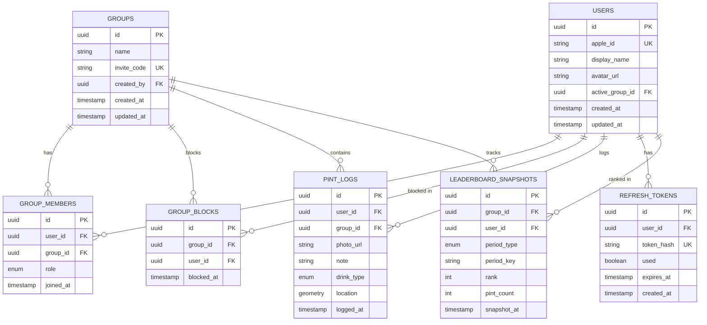

# 05 — Database (C4 Level 3)

## Purpose

This document describes the internal structure of the database container: the schema, indexes, and constraints. It does not cover how the API accesses the data; for that, see [`04-api.md`](./04-api.md). For the database's place in the broader system, see [`02-containers.md`](./02-containers.md).

The database is PostgreSQL 16 with the PostGIS extension.

---

## 1. Entity-Relationship Diagram

---

## 2. Table Definitions

### `users`

| Column | Type | Constraints | Notes |
|--------|------|-------------|-------|
| id | UUID | PK, default `gen_random_uuid()` | |
| apple_id | VARCHAR(255) | UNIQUE, NOT NULL | From Sign in with Apple |
| display_name | VARCHAR(30) | NOT NULL | 1–30 chars |
| avatar_url | TEXT | NULLABLE | S3 URL |
| active_group_id | UUID | FK → `groups.id`, NULLABLE | Persisted active group |
| created_at | TIMESTAMPTZ | NOT NULL, default `now()` | |
| updated_at | TIMESTAMPTZ | NOT NULL, default `now()` | |

### `groups`

| Column | Type | Constraints | Notes |
|--------|------|-------------|-------|
| id | UUID | PK, default `gen_random_uuid()` | |
| name | VARCHAR(50) | NOT NULL | 1–50 chars |
| invite_code | VARCHAR(8) | UNIQUE, NOT NULL | 8 alphanumeric |
| created_by | UUID | FK → `users.id`, NOT NULL | Creator |
| created_at | TIMESTAMPTZ | NOT NULL, default `now()` | |
| updated_at | TIMESTAMPTZ | NOT NULL, default `now()` | |

### `group_blocks`

| Column | Type | Constraints | Notes |
|--------|------|-------------|-------|
| id | UUID | PK, default `gen_random_uuid()` | |
| group_id | UUID | FK → `groups.id`, NOT NULL | |
| user_id | UUID | FK → `users.id`, NOT NULL | Blocked user |
| blocked_at | TIMESTAMPTZ | NOT NULL, default `now()` | When the user was removed |

- **Unique constraint**: `(group_id, user_id)`
- **Index**: `idx_group_blocks_lookup` on `(group_id, user_id)` — for join check on invite code use

### `group_members`

| Column | Type | Constraints | Notes |
|--------|------|-------------|-------|
| id | UUID | PK, default `gen_random_uuid()` | |
| user_id | UUID | FK → `users.id`, NOT NULL | |
| group_id | UUID | FK → `groups.id`, NOT NULL | |
| role | VARCHAR(10) | NOT NULL, CHECK (`role` IN ('admin', 'member')) | |
| joined_at | TIMESTAMPTZ | NOT NULL, default `now()` | |

- **Unique constraint**: `(user_id, group_id)`

### `pint_logs`

| Column | Type | Constraints | Notes |
|--------|------|-------------|-------|
| id | UUID | PK, default `gen_random_uuid()` | |
| user_id | UUID | FK → `users.id`, NOT NULL | |
| group_id | UUID | FK → `groups.id`, NOT NULL | |
| photo_url | TEXT | NOT NULL | S3 object URL |
| note | VARCHAR(280) | NULLABLE | Optional text note |
| drink_type | VARCHAR(20) | NULLABLE, CHECK (`drink_type` IN ('beer','lager','ale','stout','cider')) | |
| location | GEOMETRY(Point, 4326) | NULLABLE | PostGIS point |
| logged_at | TIMESTAMPTZ | NOT NULL, default `now()` | When the pint was logged |

- **Indexes**:
  - `idx_pint_logs_group_logged` on `(group_id, logged_at DESC)` — leaderboard queries
  - `idx_pint_logs_user_logged` on `(user_id, logged_at DESC)` — personal history
  - `idx_pint_logs_location` GIST index on `location` — bounding-box map queries

### `refresh_tokens`

| Column | Type | Constraints | Notes |
|--------|------|-------------|-------|
| id | UUID | PK, default `gen_random_uuid()` | |
| user_id | UUID | FK → `users.id`, NOT NULL | |
| token_hash | VARCHAR(64) | UNIQUE, NOT NULL | SHA-256 of token |
| used | BOOLEAN | NOT NULL, default `false` | Single-use flag |
| expires_at | TIMESTAMPTZ | NOT NULL | 30 days from creation |
| created_at | TIMESTAMPTZ | NOT NULL, default `now()` | |

- **Index**: `idx_refresh_tokens_user` on `(user_id)` — for bulk invalidation

### `leaderboard_snapshots`

| Column | Type | Constraints | Notes |
|--------|------|-------------|-------|
| id | UUID | PK, default `gen_random_uuid()` | |
| group_id | UUID | FK → `groups.id`, NOT NULL | |
| user_id | UUID | FK → `users.id`, NOT NULL | |
| period_type | VARCHAR(10) | NOT NULL, CHECK (`period_type` IN ('week', 'month')) | |
| period_key | VARCHAR(10) | NOT NULL | e.g. `"2024-W03"` or `"2024-01"` |
| rank | INTEGER | NOT NULL | |
| pint_count | INTEGER | NOT NULL | |
| snapshot_at | TIMESTAMPTZ | NOT NULL, default `now()` | |

- **Unique constraint**: `(group_id, user_id, period_type, period_key)`
- **Index**: `idx_snapshots_lookup` on `(group_id, period_type, period_key)`

---

## 3. Extensions

| Extension | Used By |
|-----------|---------|
| `postgis` | `pint_logs.location` (GEOMETRY type), bounding-box queries |
| `pgcrypto` | `gen_random_uuid()` for UUID PK defaults |

Both extensions must be enabled in the migration that creates the schema.

---

## 4. Migrations

**Status: open ADR.** Tool choice between Flyway and Liquibase is pending. Both work with Spring Boot; Flyway is leaner; Liquibase is more flexible for declarative diffs. See `adr.md`.

Conventions (regardless of tool):

- Forward-only migrations. No `down` migrations in MVP; corrections go in new migrations.
- One concern per migration file. Schema, index, and seed changes are separated.
- Naming: `V{N}__{description}.sql` (Flyway-style) or equivalent.